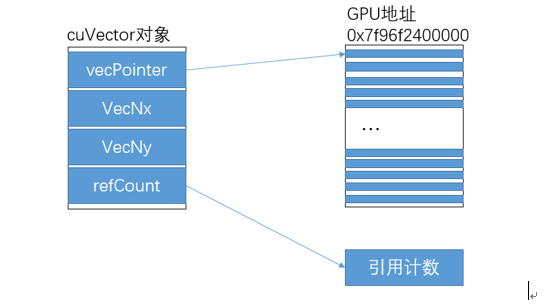
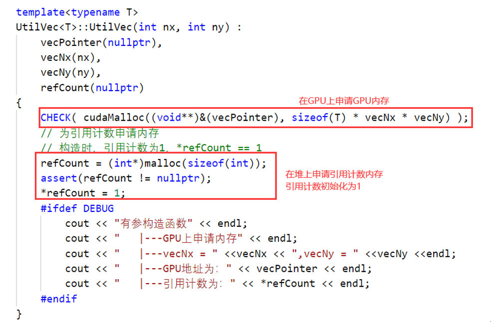
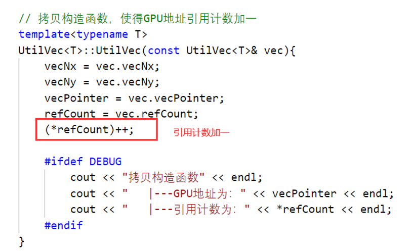
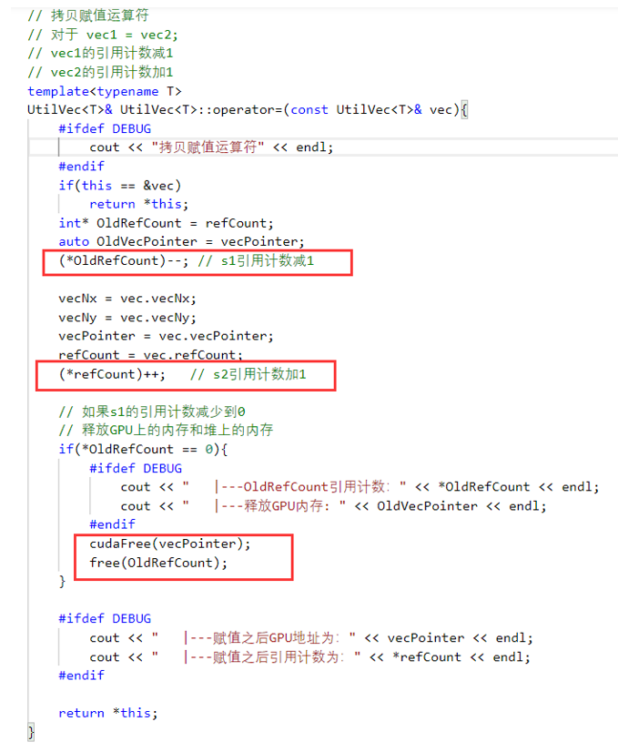
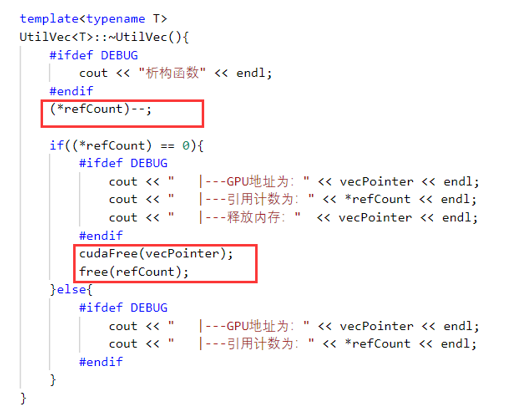
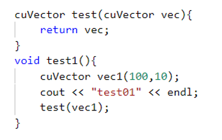
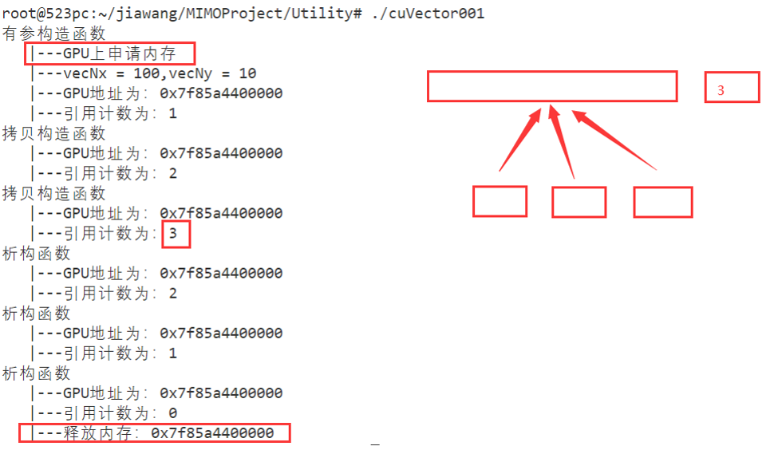
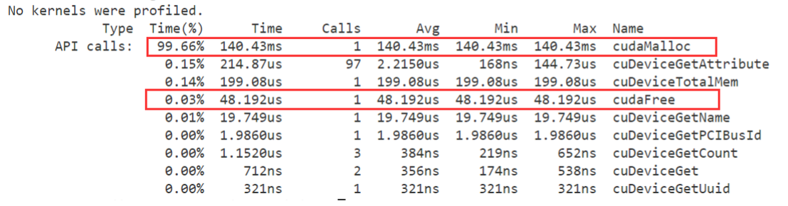
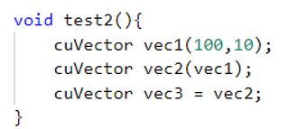
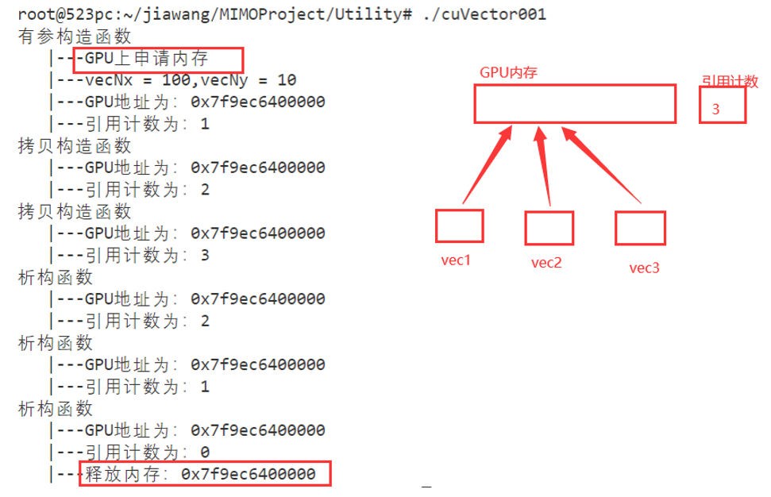

[TOC]

> 注：下面图片中的代码为了查看函数调用情况，加了很多打印语句，没有打印语句的代码查看第三节

# 一、cuVector内存结构



```c++
typedef UtilVec<cuFloatComplex> cuVector;
```

cuVector是变量类型为cuFloatComplex的GPU复数向量。对于cuVector的对象，其内存模型如上图所示。主要依赖于类模板UtilVec，下面主要介绍以下UtilVec。UtilVec类主要利用了RAII特性，仿照std::shared_ptr内存模型，对GPU的地址进行包装，并增加了引用计数。重写拷贝构造函数和拷贝赋值运算符，防止对GPU地址double free。


## (1) 构造函数



## (2) 拷贝构造函数重写



## （3）拷贝赋值运算符




## (4) 析构函数



# 二、可靠性测试

## 测试1

下面一段代码，在发生函数调用的时候，会两次调用构造函数和析构函数，如果不改写拷贝构造函数，就会申请一次释放三次，导致程序崩溃，利用改写后的拷贝构造函数，申请一次内存，释放一次内存。保证了程序的安全。





使用GPU内存分析工具nvprof分析CUDA函数调用情况：



可以看到cudaMalloc和cudaFree均只被调用了一次。

## 测试2



一共构造了三个GPU数组，但是他们指向同一块内存



# 三、代码

[Utility.h](./Utility/Utility.h)

[cuvec_test.cu](./Utility/cuvec_test.cu)